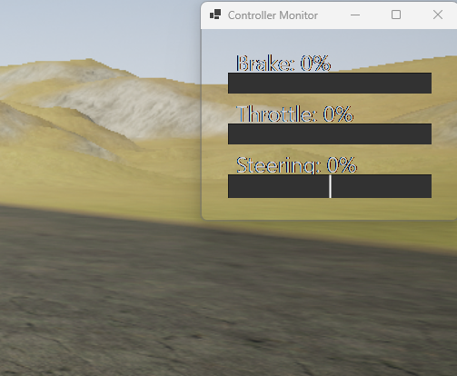

# Controller Monitor
This application is a simple transparent box for displaying common **controller** analog inputs.  

## What it shows
- Throttle
- Brake
- Steering

## Usage
Controller is needed.

### Resizing
- You can resize it like any other program.

### Moving
- You can move it like any other program

## Notes
- It is transparent and can be clicked through if you don't click the bars.
- I'll try to listen to good requests.
- It only works on windows because I'm using winforms... sorry linux users!
- Controller must be SDL2‑compatible!
- If anti-virus scans it then you may need to close it and reopen it for the layering to work correctly.

## Images

  

Note that this is the default size, but it can be smaller.

 
<EOF>
